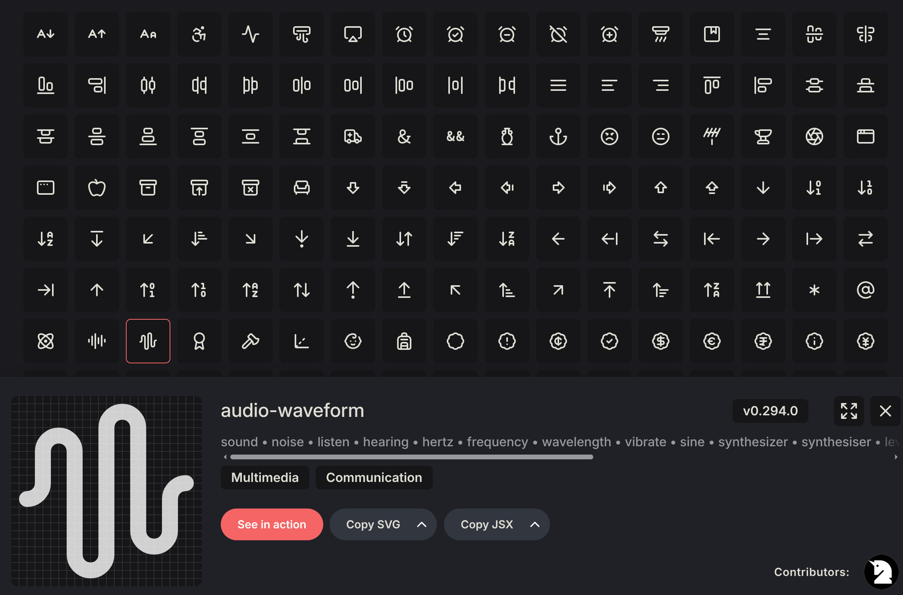

# Icon

The package provides several icon sets ready to use right after installation, as well as others that can be added directly by developers. The sets available upon installation are the following:

* [Package: Common icon for loading, actions, edit, delete etc](https://github.com/emkcloud/obsidian-ui)
* [Lucide: Beautiful & consistent icons](https://lucide.dev/)
* [Heroicons: Beautiful hand-crafted SVG icons by Tailwind CSS](https://heroicons.com/)

To use them, simply use the Blade directive `<x-obsidian::icon>`

## Usage

Where you need to specify the set name and the icon name in the following format:

```blade
<x-obsidian::icon.set.name>
```

```blade
<x-obsidian::icon.base.loading /> 
<x-obsidian::icon.hero.check-circle /> 
<x-obsidian::icon.lucide.baggage-claim />
```

Alternative method for set name and the icon name in the following format:

```blade
<x-obsidian::icon set="set" name="name">
```

```blade
<x-obsidian::icon set="base" name="loading" /> 
<x-obsidian::icon set="hero" name="check-circle" /> 
<x-obsidian::icon set="lucide" name="baggage-claim" />
```

## Sizes

There are several predefined sizes that can be specified using the `size` property.

```blade
<x-obsidian::icon.lucide.airplay/>                 <!-- 24 px -->
<x-obsidian::icon.lucide.airplay size="large"/>    <!-- 32 px -->
<x-obsidian::icon.lucide.airplay size="standard"/> <!-- 24 px -->
<x-obsidian::icon.lucide.airplay size="small"/>    <!-- 20 px -->
<x-obsidian::icon.lucide.airplay size="micro"/>    <!-- 16 px -->
```

If you need a custom size, use the [size utility classes](https://tailwindcss.com/docs/width) from Tailwind CSS.

```blade
<x-obsidian::icon.lucide.audio-waveform class="size-10"/>
<x-obsidian::icon.lucide.audio-waveform class="size-12"/>
<x-obsidian::icon.lucide.audio-waveform class="size-14"/>
```

## Color

You can customize the color of an icon using utilities [Tailwind's colors](https://tailwindcss.com/docs/color)

```blade
<x-obsidian::icon.hero.beaker class="text-black dark:text-white"/>
<x-obsidian::icon.hero.bug-ant class="text-amber-500 dark:text-amber-300"/>
<x-obsidian::icon.hero.circle-stack class="text-teal-500 dark:text-transparent"/>
```

## Special

There are special icons in the `base` set dedicated to specific operational states such as loading, edit, etc.

```blade
<x-obsidian::icon.base.loading/>
```

## Animation

You can customize the animation icon using utilities [Tailwind's animations](https://tailwindcss.com/docs/animation#adding-a-spin-animation)

```blade
<x-obsidian::icon.hero.academic-cap class="animate-spin"/>
<x-obsidian::icon.hero.academic-cap class="animate-ping"/>
<x-obsidian::icon.hero.academic-cap class="animate-pulse"/>
```

## Naming

There are over a thousand icons, each with a different name, so listing them all wouldn't be practical. The best approach is to select the desired icon name directly from the official page of the icon set.

* [Names for Icons Lucide](https://lucide.dev/icons)
* [Names for Icons Heroicons](https://heroicons.com/)

On the Heroicons page the icons are already labeled with the name. As for Lucide, since there are many more icons, you can browse by category, and after selecting the icon you're interested in, you'll be able to see the corresponding name to use.

[](https://lucide.dev/icons)

## Custom icons

For new icons create the Blade files in the `resources/views/obsidian/icon/set-name/icon-name.blade.php` in your project. Once you've added your icons, use the same Blade directive as follows:

```blade
<x-obsidian::icon.set-name.icon-name/>
<x-obsidian::icon.set-name.icon-name size="micro"/>
<x-obsidian::icon set="set-name" name="icon-name" size="small"/>
```

You can simply paste SVG code directly into the Blade file, however we recommend using the following structure to ensure compatibility with other components:

```blade
@props(['size' => 'standard'])

<svg xmlns="http://www.w3.org/2000/svg"
    width="24"
    height="24"
    fill="none"
    viewBox="0 0 24 24"
    stroke="currentColor"
    stroke-width="2"
    stroke-linecap="round"
    stroke-linejoin="round"
    aria-hidden="true"
    data-obsidian-ui-icon
    {{ $attributes->class(ObsidianUI::classesIcon($size)) }}
>
    <path ....../>
</svg>
```

